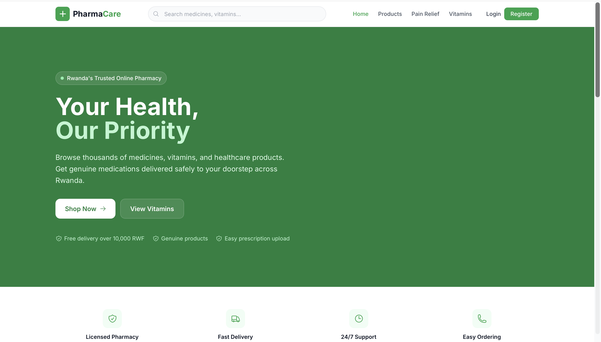
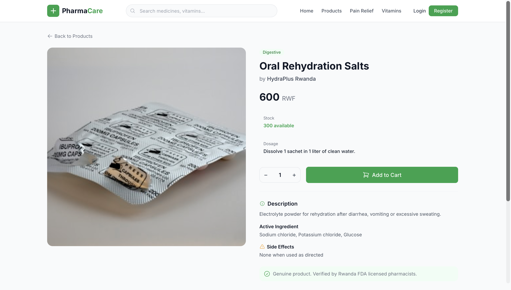
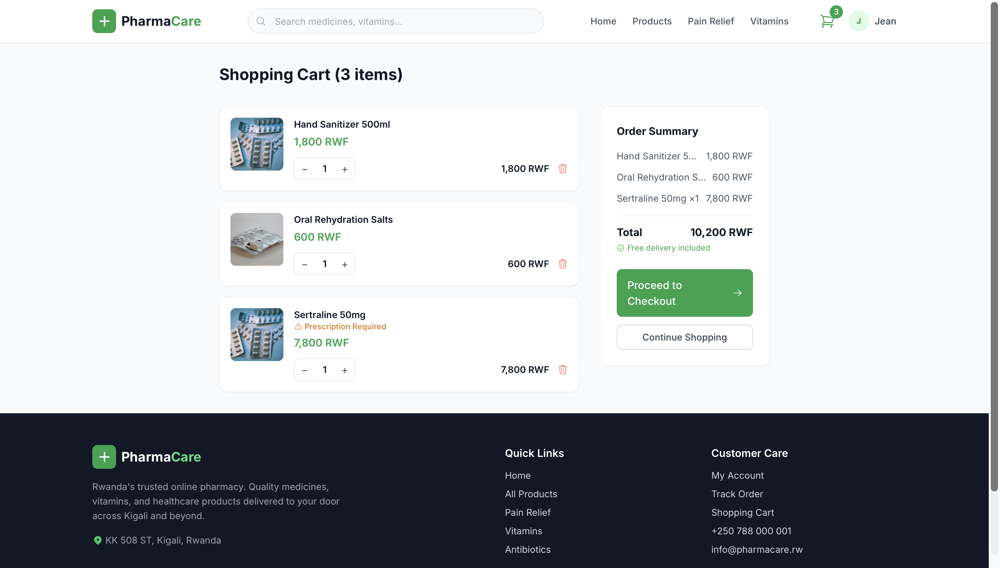
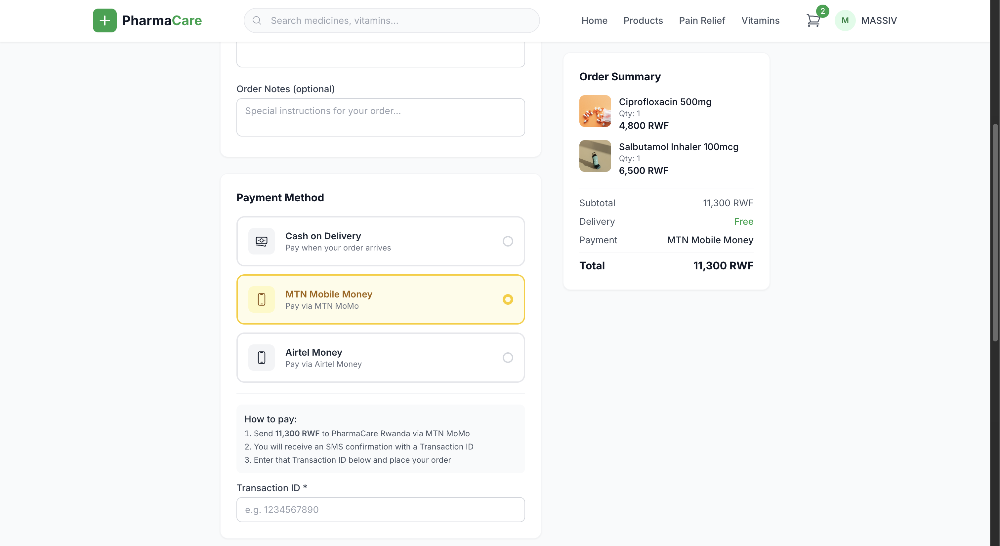
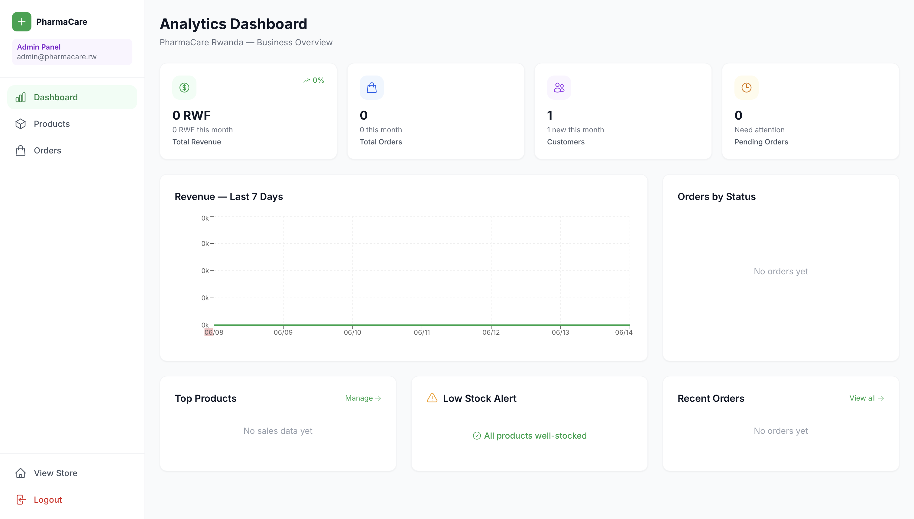
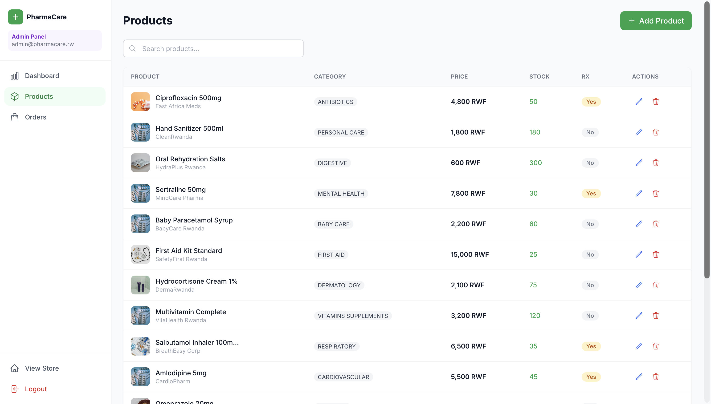

# PharmaCare Rwanda

A full-stack e-commerce pharmacy platform for Rwanda — browse medicines, upload prescriptions, pay via mobile money, and track orders online.

**Live Application:** https://pharmacare-rw.onrender.com  
**Backend API:** https://pharmacare-api-9o21.onrender.com/api/health  
**GitHub Repository:** https://github.com/LeRoiSayn/PharmaCare-RW

---

## Test Accounts

| Role | Email | Password |
|------|-------|----------|
| Admin | massivsaine@pharmacare.rw | Sain1235 |
| Customer | customer@example.com | customer123 |

---

## Screenshots

### Homepage


### Product Catalog


### Product Detail


### Shopping Cart


### Checkout with Mobile Money


### Admin Analytics Dashboard


### Admin Product Management


---

## Tech Stack

| Layer | Technology |
|-------|-----------|
| Frontend | React 18 + Vite + TailwindCSS + Zustand |
| Backend | Node.js + Express.js + Prisma ORM |
| Database | PostgreSQL 16 |
| Authentication | JWT (access + refresh tokens) + bcryptjs |
| Icons | Heroicons |
| Charts | Recharts |
| Containerization | Docker + Docker Compose |
| CI/CD | GitHub Actions |
| Deployment | Render.com |

---

## Features

- Product catalog with search, filter by category, and pagination
- Shopping cart with real-time quantity management
- Prescription upload for restricted medications
- Mobile money payment (MTN MoMo & Airtel Money) with Transaction ID verification
- Order tracking: Pending → Confirmed → Processing → Shipped → Delivered
- Admin analytics dashboard: revenue charts, top products, orders by status
- Low-stock alerts for inventory management
- Full product CRUD for admins
- JWT refresh token rotation + rate limiting


---

## Project Structure

```
pharmacare/
├── backend/
│   ├── src/
│   │   ├── controllers/     # Business logic
│   │   ├── routes/          # API endpoints
│   │   ├── middleware/       # Auth, error handling
│   │   └── app.js
│   ├── prisma/
│   │   ├── schema.prisma    # Database schema
│   │   ├── migrations/      # SQL migrations
│   │   └── seed.js          # Sample data
│   └── Dockerfile
├── frontend/
│   ├── src/
│   │   ├── components/      # Reusable UI components
│   │   ├── pages/           # Route pages + admin panel
│   │   ├── store/           # Zustand state management
│   │   └── services/        # Axios API client
│   └── Dockerfile
├── docker-compose.yml
├── docker-compose.dev.yml
└── .github/workflows/       # CI/CD pipelines
```

---

## API Endpoints

| Method | Path | Access | Description |
|--------|------|--------|-------------|
| POST | /api/auth/register | Public | Register new user |
| POST | /api/auth/login | Public | Login |
| POST | /api/auth/refresh | Public | Refresh access token |
| GET | /api/products | Public | List products (filterable) |
| GET | /api/products/:id | Public | Product detail |
| POST | /api/products | Admin | Create product |
| GET | /api/cart | User | Get cart |
| POST | /api/cart | User | Add to cart |
| POST | /api/orders | User | Place order |
| GET | /api/orders/my | User | My orders |
| GET | /api/orders | Admin | All orders |
| PUT | /api/orders/:id/status | Admin | Update order status |
| GET | /api/analytics/dashboard | Admin | Analytics data |
| POST | /api/upload/prescription | User | Upload prescription |
